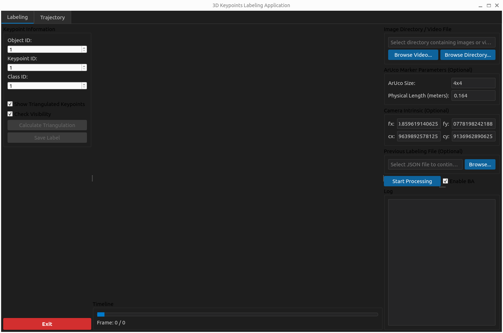
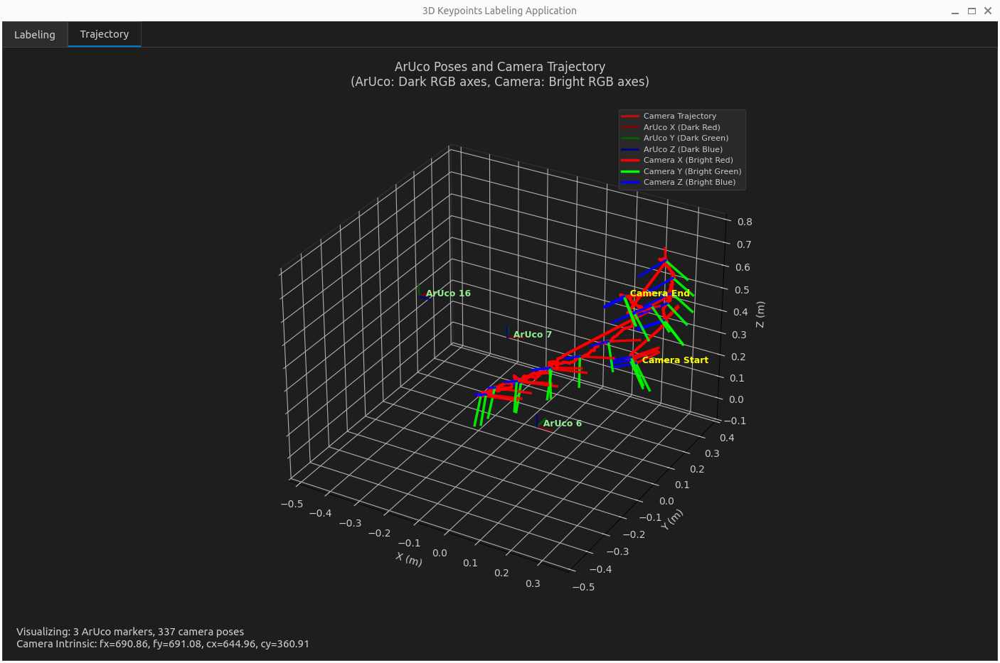
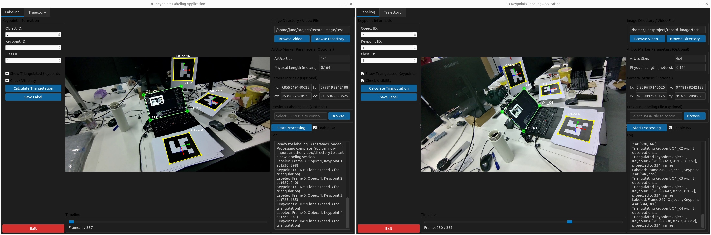
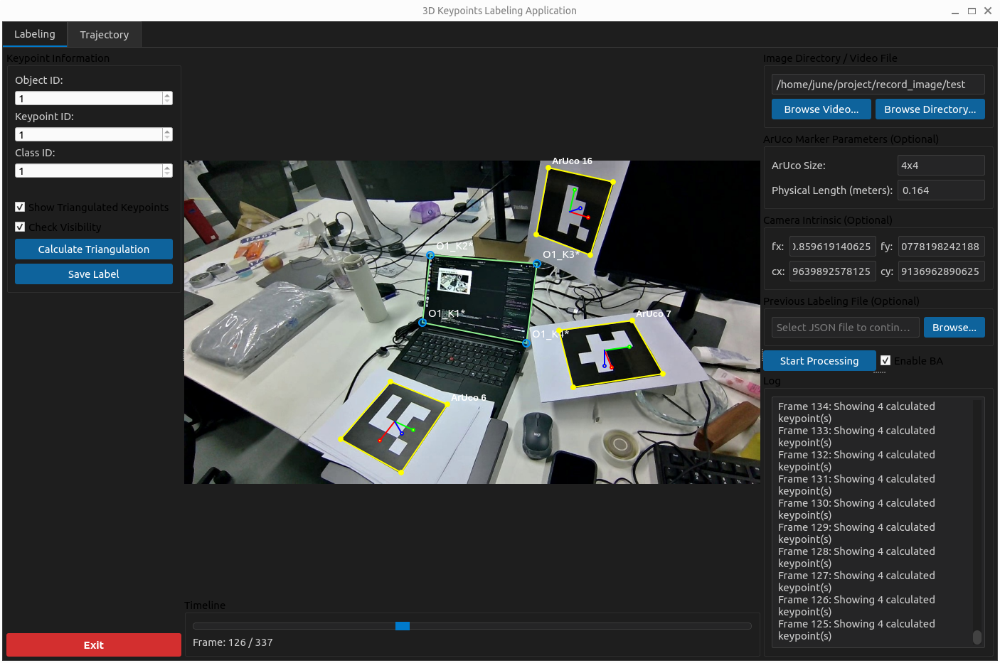

# 3D and 2D Keypoints Labeling Application

## Introduction

This application is designed for labeling 2D and 3D keypoints in static scenes. It uses ArUco markers to calculate camera intrinsics and extrinsics, enabling efficient keypoint annotation across multiple viewpoints.

**Key Features:**
- Automatic camera calibration using ArUco markers
- Interactive 2D keypoint labeling interface
- Automatic 3D keypoint reconstruction from multiple viewpoints
- Export to JSON format and YOLO pose label format

## Requirements

- Python 3.x
- ArUco markers in your images
- Camera intrinsic parameters

**Note:** The torch-cpu version is sufficient for this project; GPU is not required.

## Installation

```bash
pip install -r requirements.txt
```

**Tested on:**
- macOS 26
- Ubuntu 22.04

## Usage
### 1. Launch the App
```
python main.py
```

### 2. Load Metadata

1. Press the **Browse Video/Directory** button to load your images
2. Ensure your images contain ArUco markers
3. Provide camera intrinsic parameters



### 3. Calculate Camera Extrinsics

1. Press the **Start Processing** button
2. The application will calculate camera extrinsics for all images
3. The camera trajectory will be visualized for manual verification



**Note:** Images with fewer than 3 ArUco markers will be ignored during processing.

### 4. Label Keypoints

1. Switch to the **Labeling** tab
2. Select **at least 3** images with different viewpoints
3. Label the 2D keypoints in each selected image



4. The application will automatically generate labels for the remaining images



### 5. Save Results

1. Press the **Save Label** button
2. Valid images and labeled annotations in JSON format will be saved to `{import_path}_valid`

### 6. Transfer to YOLO Pose Label Format (Optional)

To convert the JSON annotations to YOLO pose label format:

```bash
python json_to_YoloLabel.py {annotation_path.json} {valid_image_path}
```

The converted annotations will be saved in the `{valid_image_path}` directory.

## Contact

For questions, issues, or contributions, please contact:

- jun7zhou@gmail.com
- june.zhou@x-humanoid.com